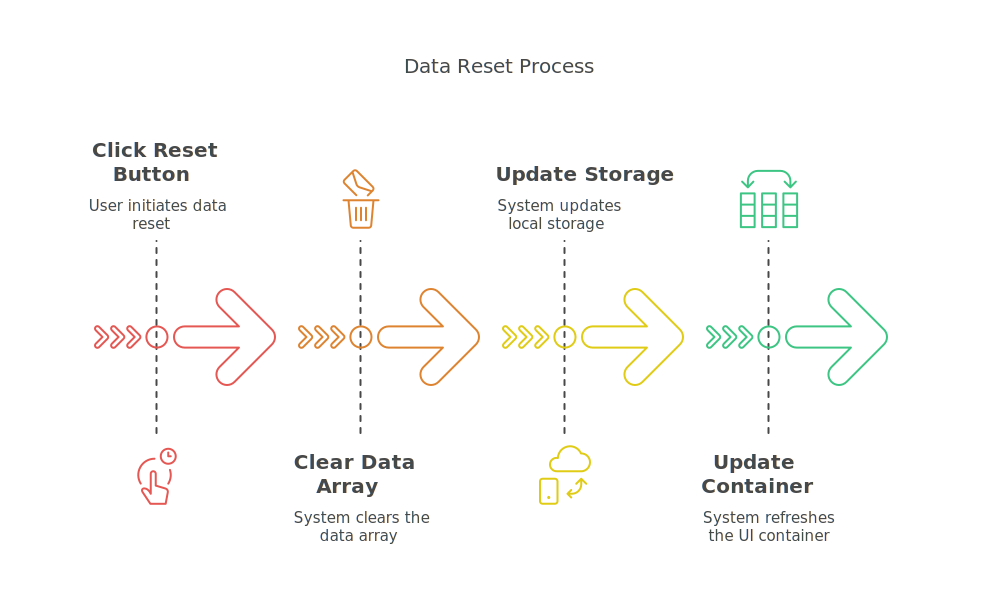

# AI 메뉴 추천 시스템

## glitch는 임시로 막아두었습니다.

## 📌 프로젝트 개요

이 프로젝트는 사용자가 입력한 텍스트를 기반으로 AI 모델이 점심 메뉴를 추천하는 웹 애플리케이션입니다.  
Bootstrap을 활용하여 반응형 UI를 적용하였으며, Gemini-1.5-Flash 및 DeepSeek-R1 모델을 선택하여 사용할 수 있습니다.

---

## 🎨 기술 스택

- **HTML5 / CSS3 / JavaScript**
- **Bootstrap 5**
- **Fetch API** (서버와 통신하여 AI 응답 받기)
- **LocalStorage** (데이터 저장 및 불러오기)

---

## 📌 주요 기능

### ✅ 메뉴 추천 시스템

- 사용자가 텍스트 입력 후, AI 모델을 선택하면 추천 결과를 표시합니다.
- `Gemini-1.5-Flash` 또는 `DeepSeek-R1` 모델 중 선택 가능.

### ✅ 로컬 저장소 활용

- 입력된 데이터를 `localStorage`에 저장하여 새로고침 후에도 유지됩니다.
- "저장된 데이터 리셋" 버튼을 눌러 데이터를 초기화할 수 있습니다.

### ✅ 반응형 UI 및 UX 향상

- Bootstrap을 활용한 **깔끔한 카드 UI** 적용.
- **삭제 버튼**을 통해 개별 추천 결과를 제거할 수 있습니다.
- **경고(alert) 박스**를 활용하여 AI의 답변을 강조.

---
